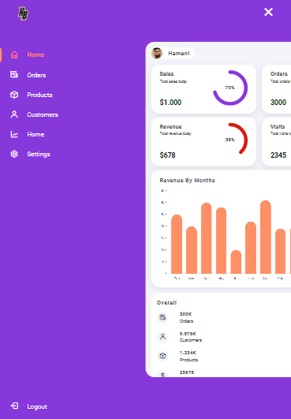

<!--
 * Template Name      : Admin Eco
 * Template Version   : V 1.0.0
 * Template Url       : .....................
 * Language           : HTML, SASS, Javascript, React
 * Contact Me : Skaype   :- Boudraa.Hammani
 *				      Facebook :- Ham mani
 *				      Email    :- Ham47mani@gmail.com
-->

<!-- PROJECT LOGO -->
 

  

  <h1 align="center">Admin Eco Dashboard</h1>

  

    Admin-eco Dashboard is a simple react responsive admin eccomerce dashboard.
     
    <a href="admin-eco.netlify.app">View Demo</a>
    ·
    <a href="https://github.com/Ham47Mani/admin-eco/issues">Report Bug</a>
    ·
    <a href="https://github.com/Ham47Mani/admin-eco/issues">Request Feature</a>
  

 
 

 
 
 

<!-- TABLE OF CONTENTS -->

  
Table of Contents

  <ol>
    <li>
      <a href="#about-the-project">About The Project</a>
      <ul>
        <li><a href="#built-with">Built With</a></li>
        <li><a href="#CSS & JS Library">CSS & JS library</a></li>
      </ul>
    </li>
    <li><a href="#contact">Contact</a></li>
  </ol>

<!-- ABOUT THE PROJECT -->
# About The Project

<b>Admin-eco</b> Dashboard is a simple react responsive admin eccomerce dashboard.

## Built With

I use i this template :

* HTML
* SASS (CSS)
* Javascript
* React
  * react router v6
  * ChartJS
  * react-circular-progressbar
  * ...

## CSS & JS Library
* Box Icons

<!-- CONTACT -->
## Contact

Hammani BOUDRAA - [@HAM47MANI](https://twitter.com/Ham7Mani) - Ham47mani@gmail.com
